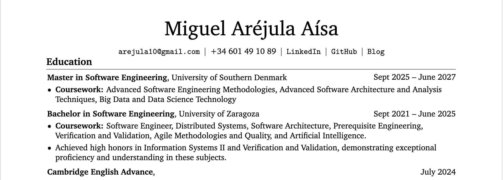

# ResumeMD

ResumeMD is a Python-based tool that converts Markdown-formatted CVs into a personalized LaTeX resume template. It simplifies the process of maintaining and updating a CV by letting you write in Markdown, which is then programmatically transformed into a polished, LaTeX-generated PDF.


## Features

* Write your CV in Markdown and generate a LaTeX PDF automatically.
* Supports sections for **Contact Information**, **Education**, **Experience**, and **Projects**.
* Preserves structured formatting and styling from the template.
* Easily extendable to multiple templates in the future.


## Requirements

* **Python 3**
* **LaTeX** installed locally (`pdflatex` must be available in your PATH)

  * On macOS: [MacTeX](https://tug.org/mactex/) or [BasicTeX](https://tug.org/mactex/morepackages.html)


## Usage

1. Prepare your CV in Markdown using the expected structure (see example below).
2. Run the renderer:

```bash
python3 ./src/render.py input/CV.md
```

This generates:

* `output_cv.tex` — the LaTeX source file
* `output_cv.pdf` — the final PDF CV


## Markdown Structure Example
Here's an example of how to structure your CV in Markdown, in case you want to see a full example you can check the [input/CV.md](input/CV.md) file included in this repository:
```md
# Miguel Aréjula Aísa

## Contact Information
- Email: string
- Phone: string
- LinkedIn: string
- GitHub: string
- Web: string

## Education

### Master in Software Engineering | University of Southern Denmark
> Sept 2025 – June 2027
- Coursework: Advanced Software Engineering Methodologies, Advanced Software Architecture, Big Data and Data Science Technology

### Bachelor in Software Engineering | University of Zaragoza
> Sept 2021 – June 2025
- Coursework: Software Engineer, Distributed Systems, Software Architecture, Verification and Validation, AI
- Achieved high honors in Information Systems II and Verification and Validation
```

>(Experience and Projects follow the same pattern as Education, with `### Title | Organization` and optional `> Dates` and `- bullets`.)


## Quick Visual Example

The previous Markdown example renders in PDF as:




## Contribution

Contributions are welcome! You can help by:

* Improving Markdown parsing and error handling.
* Adding new LaTeX templates.
* Extending functionality for custom sections or formatting.
* Reporting bugs or suggesting enhancements via GitHub Issues.

To contribute:

1. Fork the repository
2. Create a new branch (`git checkout -b feature-name`)
3. Make your changes
4. Commit (`git commit -m "Add feature"`)
5. Push (`git push origin feature-name`)
6. Open a Pull Request


## License

This project is licensed under the [MIT License](LICENSE).

You are free to use, copy, modify, merge, publish, distribute, sublicense, and/or sell copies of this software, as long as the original license is included.

